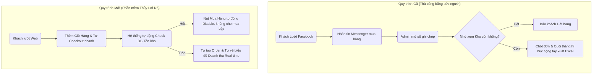

# PHÁT BIỂU BÀI TOÁN - HỆ THỐNG THƯƠNG MẠI ĐIỆN TỬ

**Nhóm thực hiện:** Thủy Lợi N5
**Môn học:** Công Nghệ Phần Mềm

## 1. Bối cảnh

Trong xu thế số hóa ngày càng mạch mẽ, thương mại điện tử đã trở thành một phần không thể thiếu của nền kinh tế. Các doanh nghiệp và cửa hàng bán lẻ truyền thống đang phải đối mặt với nhiều hạn chế như: giới hạn về không gian địa lý, thời gian mở cửa, chi phí mặt bằng và nhân sự cao.

### 1.1 Phân tích các Bên liên quan (Stakeholder Analysis)

Nhận diện rõ ai là người hưởng lợi, ai chịu ảnh hưởng để định hướng phát triển phần mềm cho đúng:

| Bên liên quan | Vai trò trong dự án | Kỳ vọng chính | Rủi ro / Rào cản |
|---------------|-------------------|--------------|--------------|
| **Khách mua hàng** | End-User (Người dùng cuối) sinh ra doanh thu | Mua hàng dễ dàng, Web tải nhanh, Mẫu mã trung thực | Sợ lộ thẻ TD, thông tin cá nhân bị bán, bị lừa đảo |
| **Quản trị viên / Chủ Shop** | Người vận hành, người dùng quản trị | Quản lý kho nhàn hạ, số liệu doanh thu chuẩn xác | Không rành về IT, sợ phần mềm quá phức tạp khó dùng |
| **Đội ngũ Phát triển** | Builder (Nhóm Thủy Lợi N5) | Hoàn thành đồ án tốt, tối đa hiệu năng với MERN Stack | Trễ Deadline môn học, code có lổ hổng bảo mật |
| **Giảng viên / Hội đồng** | Người nghiệm thu (Reviewer) | Sản phẩm chạy được thực tế, tài liệu chuẩn quy trình CNPM | Sinh viên chỉ làm web tĩnh không database, copy template |

## 2. Vấn đề thực trạng

- **Với khách hàng:** Khó khăn trong việc tìm kiếm, so sánh và xem chi tiết sản phẩm. Bất tiện trong việc di chuyển đến cửa hàng trực tiếp.
- **Với chủ cửa hàng (Quản trị viên):**
  - Khó tiếp cận nguồn khách hàng mới.
  - Quản lý sản phẩm, tồn kho và đơn hàng bằng hình thức thủ công (sổ sách, excel cơ bản) dễ gây sai sót và tốn thời gian.
  - Khó khăn trong việc theo dõi thông kê, báo cáo doanh thu để đưa ra quyết định kinh doanh kịp thời.

### 2.1 Sơ đồ Quy trình nghiệp vụ: Báo đơn thủ công (AS-IS) vs Tự động hóa (TO-BE)

Việc số hóa không chỉ đơn thuần là làm một cái Web tĩnh, mà là thay đổi hành vi tương tác toàn chuỗi. Sơ đồ dưới cho thấy phần mềm thay thế con người ở những khâu cốt lõi:

## 3. Mục tiêu dự án

Dự án nhằm xây dựng một **Website Thương Mại Điện Tử** giúp giải quyết các vấn đề trên, tập trung vào:

- **Tự động hóa:** Tối ưu hóa quy trình từ lúc khách hàng xem sản phẩm, thêm vào giỏ hàng, đặt hàng cho đến khi admin xử lý đơn một cách hoàn toàn trên máy tính thay vì ghi sổ.
- **Thống kê / Báo cáo:** Cung cấp cho người quản trị **Dashboard** (Bảng điều khiển quản trị tập trung) giám sát doanh thu động trực quan bằng các biểu đồ, đồng thời có khả năng xuất dữ liệu báo cáo ra file Excel để gửi cấp trên hoặc đối tác.
- **Nâng cao trải nghiệm User (Người dùng):** Cung cấp giao diện trực quan, rõ ràng, thao tác mượt mà dễ sử dụng cho khách hàng từ khâu chọn đồ đến khi thanh toán.

### 3.1 Bảng Phân tích Định hướng Phát triển (SWOT)

| Điểm mạnh (Strengths) | Điểm yếu (Weaknesses) |
|---|---|
| - Giao diện React hiện đại, chuyển trang không giật lag. - API tự thiết kế bằng Node.js giúp nhóm chủ động 100% Data. - Áp dụng mật khẩu băm Bcrypt an toàn. | - Server test miễn phí (Render) bị "ngủ đông" nếu ít truy cập. - Chức năng tìm kiếm chưa hỗ trợ Fuzzy Search (gõ sai chính tả). |
| **Cơ hội (Opportunities)** | **Thách thức (Threats)** |
| - Lập trình API chuẩn REST giúp dễ dàng mở rộng lên riêng App Mobile sau này. - Tài liệu bài bản chuẩn IEEE làm Showcase nổi bật cho CV đi thực tập. | - Các sàn Shopee/Lazada quá lớn, web tự build khó cạnh tranh nguồn traffic khách mua tự nhiên. - Bot tấn công DDoS (Đã chặn cơ bản bằng Rate-Limit). |

## 4. Phạm vi dự án

Dự án được triển khai theo các giai đoạn (Phases) nhằm phân bổ nguồn lực hợp lý.

### Giai đoạn 1 (Phase 1) - Hiện tại (Đã hoàn thành)

- Hệ thống quản lý tài khoản và giỏ hàng cơ bản.
- Chức năng duyệt, tìm kiếm, xem chi tiết sản phẩm.
- Đặt hàng và quản lý đơn hàng.
- Trang Giới thiệu (About) của nhóm phát triển.
- Hệ thống Admin Dashboard: Quan sát báo cáo doanh thu đa khung thời gian (ngày, tuần, tháng), biểu đồ top sản phẩm bán chạy, xuất file Excel đơn hàng.

### Giai đoạn 2 (Phase 2) - Kế hoạch mở rộng

- Tính năng đánh giá và bình luận sản phẩm (Ratings & Reviews).
- Hệ thống Khuyến mãi / Mã giảm giá (Vouchers/Coupons).
- Gợi ý sản phẩm thông minh dựa trên hành vi truy cập.
- Nâng cấp phần quyền cho Admin (Super Admin / Staff) và quản lý kho hàng, thiết lập Email Notification.
- Tích hợp cổng thanh toán trực tuyến (VNPAY / Momo Sandbox).
