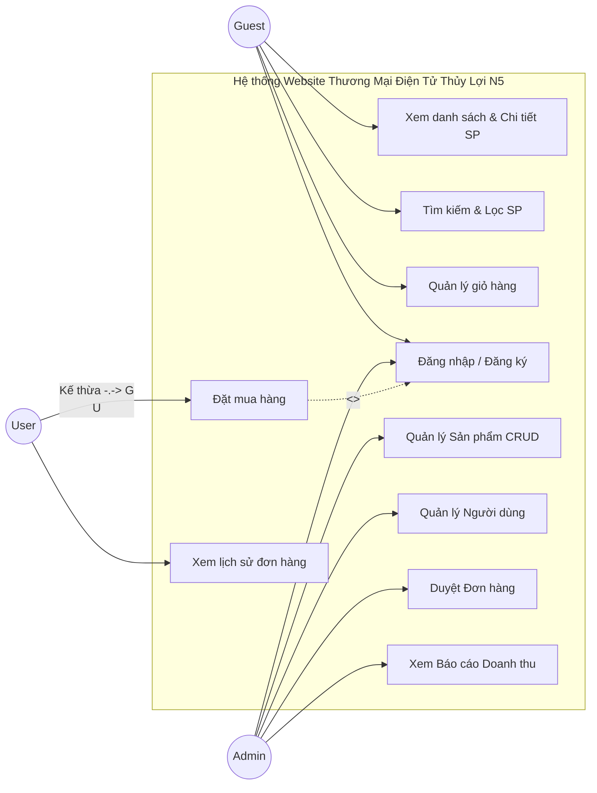

# ĐẶC TẢ YÊU CẦU NGƯỜI DÙNG (USE CASES)

## 1. Danh sách Tác nhân (Actors)

- **Khách hàng vãng lai (Guest):** Người dùng truy cập website nhưng chưa có tài khoản hoặc chưa đăng nhập. Có thể xem sản phẩm và thêm vào giỏ hàng cục bộ nhưng không thể thanh toán.
- **Khách hàng (User):** Người dùng đã đăng ký tài khoản cấu hình thông tin cá nhân và đăng nhập thành công. Kế thừa quyền của Guest và có thêm quyền quản lý đơn hàng, thanh toán.
- **Quản trị viên (Admin):** Người đứng sau hệ thống, có quyền điều hành, quản lý thay đổi nội dung dữ liệu kinh doanh (CRUD Sản phẩm, Quản lý User) và theo dõi báo cáo doanh thu.

---

## 2. Sơ đồ Use Case (Use Case Diagram)

---

## 3. Danh sách Use Case - Giai đoạn 1 (Phase 1)

### 3.1. Nhóm chức năng Khách hàng (User)

| Mã UC | Tên Use Case | Phân hệ | Mức ưu tiên | Mô tả |
|-------|--------------|---------|-------------|-------|
| UC-U01 | Đăng ký tài khoản | Xác thực | Cao | Đăng ký với email, mật khẩu |
| UC-U02 | Đăng nhập | Xác thực | **Rất cao** | Đăng nhập bằng tài khoản và mật khẩu |
| UC-U03 | Xem danh sách SP | Cửa hàng | Cao | Hiển thị tất cả các sản phẩm có trên gian hàng |
| UC-U04 | Tìm kiếm & Lọc SP | Cửa hàng | Trung bình | Nhập từ khóa để tìm sản phẩm hoặc lọc nâng cao |
| UC-U05 | Xem chi tiết SP | Cửa hàng | Cao | Hiển thị hình ảnh, giá, mô tả sản phẩm |
| UC-U06 | Thêm vào giỏ hàng | Giỏ hàng | **Rất cao** | Thêm sản phẩm vào giỏ, tùy chỉnh số lượng |
| UC-U07 | Xem & Sửa giỏ hàng | Giỏ hàng | Cao | Xem và chỉnh sửa danh sách sản phẩm sắp mua |
| UC-U08 | Đặt hàng (Checkout) | Mua hàng | **Rất cao** | Nhập thông tin giao hàng và xác nhận mua hàng |
| UC-U09 | Xem lịch sử đơn hàng | Mua hàng | Trung bình | Theo dõi các đơn hàng đã đặt và trạng thái |
| UC-U10 | Xem trang Giới thiệu | Thông tin | Thấp | Xem thông tin về nhóm phát triển Thủy Lợi N5 |

### 3.2. Nhóm chức năng Quản trị (Admin)

| Mã UC | Tên Use Case | Phân hệ | Mức ưu tiên | Mô tả |
|-------|--------------|---------|-------------|-------|
| UC-A01 | Quản lý Người dùng | Hệ thống | Trung bình | Xem danh sách user, xóa hoặc cấp quyền tài khoản |
| UC-A02 | Thêm Sản phẩm mới | Sản phẩm | Cao | Đăng tải sản phẩm mới (Create) kèm ảnh, giá, tồn kho |
| UC-A03 | Xem danh sách SP | Sản phẩm | Cao | Hiển thị bảng tổng hợp toàn bộ sản phẩm (Read) |
| UC-A04 | Cập nhật Sản phẩm | Sản phẩm | Trung bình | Chỉnh sửa lại giá tiền, hình ảnh thông tin SP (Update) |
| UC-A05 | Xóa Sản phẩm | Sản phẩm | Thấp | Gỡ bỏ hoàn toàn một sản phẩm khỏi cửa hàng (Delete) |
| UC-A06 | Quản lý Đơn hàng | Đơn hàng | **Rất cao** | Xem danh sách, chi tiết và cập nhật trạng thái đơn duyệt |
| UC-A07 | Xem Dashboard KPI | Báo cáo | **Rất cao** | Xem biểu đồ doanh thu theo Ngày/Tuần/Tháng |
| UC-A08 | Xem Top Sản phẩm | Báo cáo | Cao | Biểu đồ thống kê các sản phẩm bán chạy nhất |
| UC-A09 | Xuất Data Hóa đơn | Báo cáo | Trung bình | Trích xuất export báo cáo ra định dạng Excel (.xlsx) |

---

## 4. Đặc tả chi tiết Use Case (Use Case Specification)

Dưới đây là đặc tả luồng sự kiện (Flow of Events) cho 3 luồng chức năng quan trọng nhất của hệ thống phục vụ thiết kế Backend và Unit Test.

### 4.1. UC-U02: Đăng nhập (Login)

- **Tác nhân chính:** Guest, User, Admin
- **Tiền điều kiện:** Người dùng đang ở màn hình Đăng nhập.
- **Luồng sự kiện chính (Happy Path):**
  1. Người dùng nhập Email và Mật khẩu.
  2. Người dùng nhấn nút "Đăng nhập".
  3. Hệ thống kiểm tra tính hợp lệ của Email và Mật khẩu dưới Database.
  4. Hệ thống tạo JWT Access Token và Refresh Token.
  5. Hệ thống lưu Token vào cookie/local storage phân quyền đăng nhập thành công.
- **Luồng ngoại lệ (Alternative Flow):**
  - *Email không tồn tại hoặc sai định dạng:* Hệ thống hiển thị lỗi "Tài khoản không tồn tại".
  - *Sai mật khẩu:* Hệ thống hiển thị lỗi "Mật khẩu không chính xác".
- **Hậu điều kiện:** Navbar thay đổi trạng thái sang "Đã đăng nhập", hiển thị Avatar người dùng.

### 4.2. UC-U08: Đặt hàng (Checkout)

- **Tác nhân chính:** User
- **Tiền điều kiện:** User đã đăng nhập và Giỏ hàng có ít nhất 1 sản phẩm hợp lệ, tồn kho > 0.
- **Luồng sự kiện chính (Happy Path):**
  1. User điều hướng từ Giỏ hàng sang trang Checkout.
  2. Hệ thống tải thông tin mặc định cá nhân (Tên, SĐT, Địa chỉ).
  3. User xác nhận hoặc chỉnh sửa thông tin giao hàng, chọn Phương thức thanh toán (COD).
  4. User bấm "Đặt Hàng".
  5. Hệ thống trừ tồn kho (Stock) của Sản phẩm tương ứng trong MongoDB.
  6. Hệ thống tạo Record Đơn hàng mới trạng thái "Chờ xác nhận".
  7. Hệ thống xóa trắng Giỏ hàng của User.
  8. Hiển thị màn hình "Đặt hàng thành công".
- **Luồng ngoại lệ:**
  - *Sản phẩm hết hàng trong lúc đang Checkout:* Báo lỗi "Sản phẩm X không đủ số lượng", rollback giao dịch.
- **Hậu điều kiện:** Đơn hàng chờ Admin duyệt, kho hàng giảm số lượng.

### 4.3. UC-A07: Xem Dashboard Báo Cáo

- **Tác nhân chính:** Admin
- **Tiền điều kiện:** Admin đã đăng nhập thành công với role `isAdmin=true`.
- **Luồng sự kiện chính (Happy Path):**
  1. Admin bấm vào menu "Dashboard".
  2. Frontend gửi request lấy Recharts Data kèm chuỗi JWT Token xác thực.
  3. Backend Mongoose chạy Aggregation Pipeline gom nhóm doanh thu theo Ngày/Tháng.
  4. Backend trả về Object JSON dữ liệu mảng.
  5. Frontend vẽ biểu đồ Line Chart và Pie Chart mô tả Trạng thái đơn, Top sản phẩm.
- **Luồng ngoại lệ:**
  - *Token hết hạn:* Hệ thống báo phiên đăng nhập hết hạn và đẩy về trang `/sign-in`.
- **Hậu điều kiện:** Màn hình Dashboard render xong không bị trống (No Data).

---

## 5. Danh sách Use Case - Giai đoạn 2 (Phase 2 - Mở rộng tương lai)

- **UC-U11 (Đánh giá & Bình luận):** Khách hàng đã mua hàng thành công có thể rate từ 1-5 sao và để lại review vào sản phẩm tương ứng.
- **UC-U12 (Gợi ý sản phẩm đồ họa):** Website tự động gợi ý thêm sản phẩm cùng danh mục.
- **UC-U13 (Sử dụng Voucher):** Áp dụng mã giảm giá lúc Checkout để giảm tổng tiền thanh toán.
- **UC-U14 (Đăng nhập MXH):** Tích hợp Google OAuth/Facebook SSO.
- **UC-U15 (Nhận Email thông báo):** Khách hàng nhận hoá đơn điện tử qua Nodemailer tự động.
- **UC-A10 (Cảnh báo Tồn kho):** Nhận được alert cảnh báo nguy cơ hết hàng kho.
- **UC-A11 (Quản lý Khuyến mãi/Vouchers):** Khả năng tùy chỉnh tạo mã voucher giảm giá, giới hạn.
- **UC-A12 (Phân quyền nâng cao Role-Based):** Admin chia quyền bảo vệ (Super Admin, Order Manager...).
- **UC-A13 (Chat trực tuyến hỗ trợ):** Có pop-up kết nối để tư vấn khách hàng ngay lập tức.
