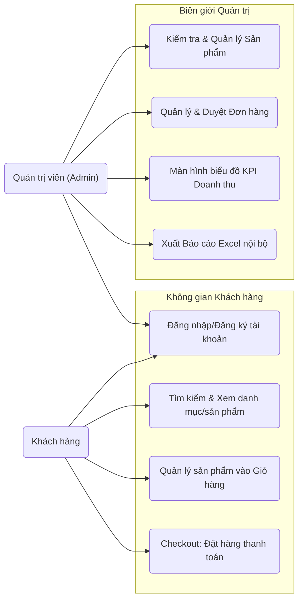

# ĐẶC TẢ YÊU CẦU PHẦN MỀM (SRS - Software Requirements Specification)

## 1. Giới thiệu

Tài liệu này cung cấp mô tả chi tiết các yêu cầu kỹ thuật và chức năng của Hệ thống Thương Mại Điện Tử định chuẩn, thiết kế cho đồ án môn Công Nghệ Phần Mềm bởi Nhóm Thủy Lợi N5.

## 2. Môi trường hệ thống / Công nghệ áp dụng

Dự án được triển khai dựa trên hệ sinh thái **MERN Stack** (MongoDB, Express, React, Node.js). Đây là nền tảng công nghệ phổ biến giúp đồng nhất ngôn ngữ học Javascript ở toàn bộ các lớp (cả Frontend và Backend) của một dự án lớn, giúp tối ưu thời gian phát triển.

Lý do lựa chọn **MERN Stack**:

- **JavaScript xuyên suốt:** Toàn bộ stack được viết bằng một ngôn ngữ JavaScript/TypeScript. Việc chia sẻ kiến thức giữa Frontend dev và Backend dev dễ dàng hơn, tận dụng lại code/các module utility.
- **Tính phi logic (Non-blocking I/O) trên Node.js:** Giao tiếp rất tốt trong mô hình hệ thống bán hàng đa giao dịch (I/O intensive) hơn các nền tảng cũ. Xử lý nhiều kết nối trong khi không hao tốn tài nguyên quá nhiều.
- **JSON đi cùng Mongoose/MongoDB:** Luồng di chuyển dữ liệu thông suốt, uyển chuyển (JSON từ Client UI -> Server Parser -> Document Database Schema) giúp bỏ qua khâu mapping bảng biểu cồng kềnh như ở CSDL Quan hệ.
- **ReactJS SPA (Single Page Application):** Thay vì nạp đi nạp lại trang, ReactJS tạo trải nghiệm rất mượt mà trong các thao tác mua hàng.
- **Hệ Sinh Thái khổng lồ của NPM:** Rất nhiều gói tiện ích về xử lý ảnh, encode, auth hỗ trợ đắc lực tích hợp nhánh nhanh chóng.

Các công nghệ phụ trợ chính:

- **Frontend Stack (Mặt tiền người dùng):** ReactJS, Redux Toolkit, React Query (quản lý trạng thái dữ liệu ngầm mà không làm đơ giao diện), Ant Design (Bộ khung thiết kế nút bấm/bảng biểu đẹp mắt), Recharts (Thư viện chuyên vẽ biểu đồ báo cáo).
- **Backend Stack (Bộ não máy chủ):** Node.js, ExpressJS v4, JWT Authentication (Hệ thống khóa cửa bằng thẻ từ ảo - JsonWebToken), Bcrypt (Kỹ thuật băm nát và mã hóa mật khẩu để hacker không đọc được chữ gốc).
- **Cơ sở dữ liệu:** Hệ quản trị CSDL Document-based MongoDB (Lưu dữ liệu dạng văn bản tự do), kết hợp với ORM Mongoose (Công cụ "chuyển ngữ" dịch từ dữ liệu Mongo sang mã Code Node.js).

## 3. Quy trình phát triển (Software Process Model)

Là môn học Công Nghệ Phần Mềm nhấn mạnh vào Quy trình (Process), nhóm N5 đã áp dụng **Mô hình Agile / Scrum** cho dự án lần này, bao gồm các Sprint ngắn tính bằng tuần.

Lý do lựa chọn **Agile Scrum**:

- **Khả năng đối phó với sửa đổi yêu cầu liên tục:** Đồ án có các Phase phát triển với mức độ thay đổi UI/UX nhiều lần trong suốt quá trình hoàn thiện đồ án mà không bị hạn chế như Waterfall.
- **Chuyển tải giá trị sớm sớm ra sản phẩm (Deliver early):** Nhóm phân chia Phase 1 với các chức năng đủ chu trình mua hàng làm MVP (Minimum Viable Product). Nếu thời gian cho phép, Sprint tiếp theo sẽ bao thầu báo cáo, chart..
- **Cải thiện làm việc nhóm (Teamwork):** Cho phép các thành viên Frontend / Backend làm việc độc lập qua phân công công việc (Task Assignment) nhưng vẫn khớp được nối API nhờ các Daily meeting check API.

## 4. Yêu cầu chức năng (Functional Requirements)

### 4.1 Giai Đoạn 1 (Phase 1)

- **FR_01 (Xác thực / Cấp quyền - Auth):** Hệ thống có cơ chế xác thực JWT qua 2 token rào chắn: AccessToken (Vé vào cửa ngắn hạn - 1 giờ) và RefreshToken (Vé đổi dài hạn - 30 ngày). Mật khẩu hoàn toàn là mã hóa hash một chiều chuẩn bcrypt trước khi ghim vào database nên kể cả kĩ sư thiết kế cũng không tự đọc được mật khẩu khách hàng.
- **FR_02 (Quản lý Giỏ hàng):** Giỏ hàng được quản lý theo dạng lưu lượng ở máy người dùng (Local state và Redux Store), cập nhật số lượng realtime giảm thiểu tình trạng giật lag, tránh việc mỗi lần ấn "+" tăng số lượng lại phải gửi tín hiệu qua lại máy chủ quá nhiều lần.
- **FR_03 (Quản trị Sản phẩm):** Tính năng nghiệp vụ cho phép Admin thực hiện đầy đủ luồng Tạo mới, Danh sách, Sửa thông tin, Xóa. Hình ảnh sản phẩm được hỗ trợ mã hóa định dạng chuẩn để dễ dàng truy xuất tại máy trạm.
- **FR_04 (Quy trình Đặt hàng):** Xác nhận thanh toán từ User sẽ tự động dọn sạch giỏ hàng hiện tại. Đơn hàng sinh ra được hệ thống tự động ghi nhận thời gian chính xác tới từng giây (`createdAt` / `updatedAt`) cho mục đích truy vết hàng hóa sau này và vẽ báo cáo thống kê.
- **FR_05 (Dashboard / Biểu đồ):** Máy chủ tự tính toán doanh thu (Revenue) thông qua bộ lọc thông minh (Chỉ tính đơn đã mua `isPaid=true`) phối hợp với bộ công cụ Recharts bên phía giao diện (React Client) nhằm hiển thị dưới dạng biểu đồ cột, biểu đồ tròn theo linh hoạt các khung thời gian: Ngày, tuần, tháng.
- **FR_06 (Trích xuất dữ liệu):** Quyền thao tác Export (Xuất báo cáo) cho Admin, cho phép trích xuất các đơn hàng ở dạng lưới và tải xuống file Excel (.XLSX) chuẩn chỉnh giúp thuận tiện mở trên Office máy tính để trình sếp/nhà đầu tư.

### 4.2 Giai Đoạn 2 (Phase 2 - Mở rộng tương lai)

- **FR_07 (Social Reviews):** Bổ sung Collection `ReviewModel` khóa ngoại trỏ tới `Product` và `User`, yêu cầu validation chỉ cho phép submit đánh giá lúc `Order` (đơn hàng) xác thực đã thành công.
- **FR_08 (Coupon / Vouchers engine):** Xây dựng bộ Engine Voucher tự động kiểm tra tham số: Code tồn tại, Ngày hết hạn, Số lượng Capacity. Áp dụng Middleware tính lại TotalPrice Checkout.
- **FR_09 (Event Emailing):** Gọi Nodemailer tự động bắt event kích hoạt gửi mã xác nhận OTP / Hoá đơn gửi thẳng đến email khách hàng (via SMTP Transport) tại các trigger trên backend.

## 5. Yêu cầu phi chức năng (Non-Functional Requirements)

- **Hiệu năng (Performance / Latency):**
  - Tải trang danh mục sản phẩm mất < 2 giây. Web sử dụng React Query để fetch và cache dữ liệu, giảm thiểu thừa API Requests.
  - Sử dụng cơ chế Rate Limiting API (express-rate-limit) tại cổng Backend phòng tránh nghẽn truy cập và DDoS nhẹ.
- **Bảo mật (Security):**
  - Toàn bộ secret strings và database string connections (DB URI), JWT Key giấu kín trong environment variables `.env`.
  - Endpoint của admin chặn kỹ lưỡng qua Authorization header và Check Role middleware `isAdmin`.
- **Khả năng mở rộng (Scalability & Maintainability):** Backend triển khai Controller - Service Pattern rõ ràng giúp mã nguồn rất gọn gàng. Có thể nâng cấp logic và dễ dàng chuyển thành Microservices hoặc Dockerize lên container platform về sau.
- **Thân thiện người dùng (UX / Usability):** UI được đồng bộ design system từ thư viện Ant Design đem lại nét hiện đại, tối ưu responsive.

## 6. Biểu đồ Use Case Tổng quan

