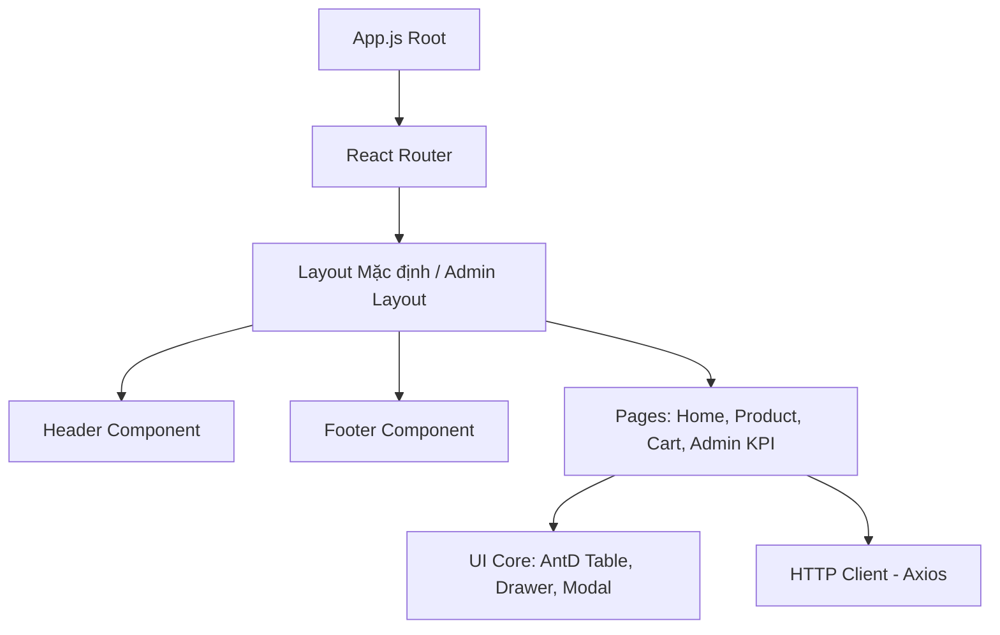
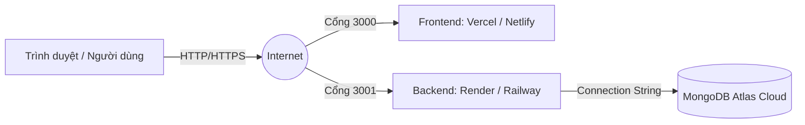
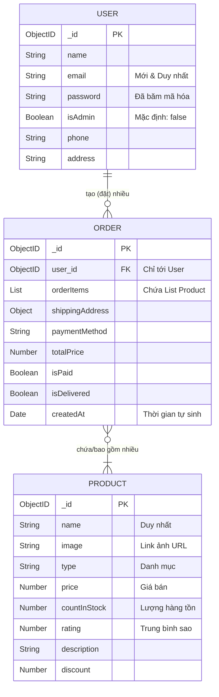
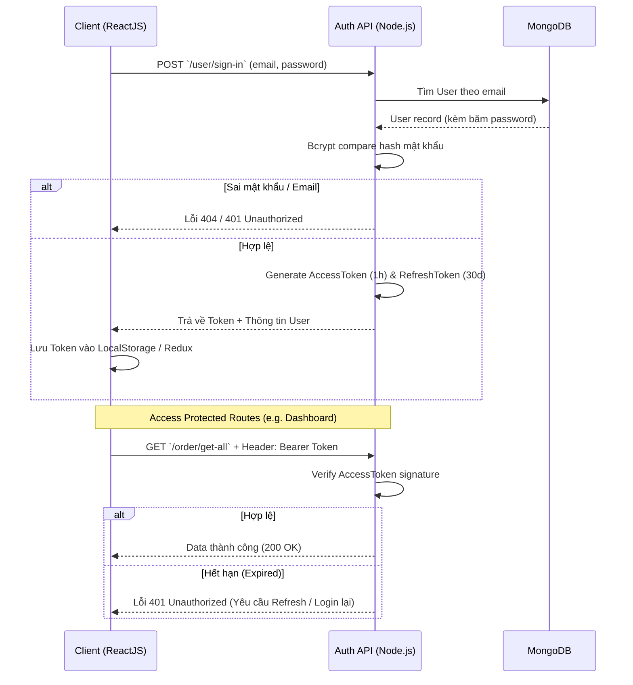
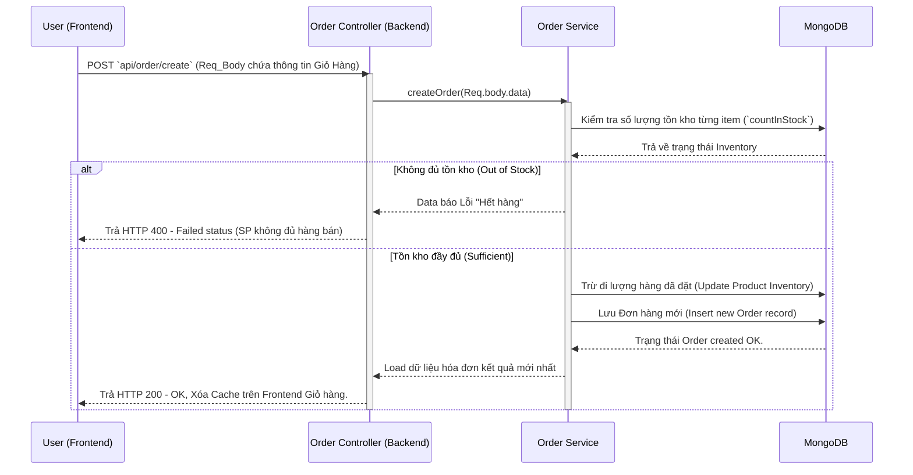

# TÀI LIỆU THIẾT KẾ CẤP CAO (HLD - High-Level Design)

## 1. Kiến trúc Hệ thống (Architecture)

Hệ thống sử dụng mô hình **Client-Server Architecture** (Kiến trúc Khách - Chủ) tiêu chuẩn. Việc giao tiếp giữa UI trên trình duyệt người dùng và Máy chủ đều tuân thủ qua định tuyến **RESTful APIs** (Chuẩn giao thức gửi và nhận dữ liệu an toàn trên diện rộng của Internet).

```mermaid
graph TD
    Browser[Trình duyệt Khách hàng] -->|Render| UI[Frontend App - ReactJS / Redux]
    UI <--> |HTTP Requests / JSON / REST| API[Backend RESTful API - Node.js/Express]
    API <--> |Mongoose ODM (Driver)| DB[(Database - MongoDB)]
```

### 1.1 Tầng Frontend (ReactJS/SPA)

Tuân theo mô hình phân lớp Component - Caching - Global State:

- **Components:** Các "Viên gạch" đồ họa chia nhỏ, có tính tái sử dụng cao như Giao diện một nút bấm, Menu phía trên (Header).
- **Pages (Trang):** Tập hợp trọn vẹn các thành phần màn hình độc lập như Trang Chủ, Trang Chi Tiết Sản Phẩm.
- **Redux/Toolkit:** Kho tàng lưu trữ trạng thái toàn cục tránh việc truyền props quá sâu (Prop Drilling).
- **React Query:** Quản lý state của API, tự động Caching và Refetching dữ liệu giúp web mượt hơn.

**Sơ đồ Khối Frontend (Component Diagram):**



### 1.2 Tầng Backend (Logical Server)

Xây dựng trên Runtime Environment NodeJS, framework Express tuân theo dạng **Route -> Controller -> Service Model**. Cắt giảm phụ thuộc code logic chồng chéo:

- **Routes (`src/routes`):** Định tuyến URL endpoint từ các HTTP methods (GET, POST, PUT, DELETE). Routing check Auth tại đây.
- **Controllers (`src/controllers`):** Xử lý input từ client gửi lên (Req.body, Req.params), điều phối kết quả trả về đúng format Response (JSON).
- **Services (`src/services`):** Khối lõi logic nghiệp vụ sâu (logic tính toán doanh thu, mã hóa, transaction).
- **Models (`src/models`):** Khai báo schema chuẩn từ Mongoose ánh xạ vào các Collection riêng tại MongoDB.

### 1.3 Môi trường Triển khai (Deployment Architecture)



## 2. Thiết kế Cơ sở Dữ liệu (Database Schema / Entities)

Hệ thống sử dụng MongoDB là Cơ sở dữ liệu phi quan hệ (NoSQL), do đó các bản ghi được lưu dưới dạng "Tài liệu" (Documents / JSON Object) rất linh hoạt thay vì ép vào khung Dạng bảng (Tables) cứng nhắc như SQL truyền thống. Dưới đây là Sơ đồ quan hệ thực thể (ERD) và cấu trúc cốt lõi:

### 2.1 Sơ đồ Quan hệ Thực thể (ERD)



### 2.2 Đặc tả Thực thể: `User` (Tài khoản)

- `_id`: ObjectID
- `name`: String (Required)
- `email`: String (Required + Unique)
- `password`: String (Required, được Hash BCrypt)
- `isAdmin`: Boolean (Default false)
- `phone`: String
- `address`: String

### 2.3 Đặc tả Thực thể: `Product` (Sản phẩm)

- `_id`: ObjectID
- `name`: String (Unique)
- `image`: String (URL or Base64 encode)
- `type`: String (Category)
- `price`: Number
- `countInStock`: Number (Phục vụ nghiệp vụ bán hàng)
- `rating`: Number (Mức đánh giá)
- `description`: String (Mô tả thông tin chi tiết item)
- `discount`: Number

### 2.4 Đặc tả Thực thể: `Order` (Đơn đặt hàng)

- `_id`: ObjectID
- `orderItems`: Array of Object `{ name, amount, image, price, product(Ref: ObjectID) }`
- `shippingAddress`: Object `{ fullName, address, city, phone }`
- `paymentMethod`: String (VD: FAST, GOJEK, CASH...)
- `itemsPrice`: Number
- `shippingPrice`: Number (Phí giao hàng)
- `totalPrice`: Number (Tổng giá bill cuối cùng)
- `user`: ObjectID (Ref to `User`)
- `isPaid`: Boolean (Xác nhận thu tiền)
- `paidAt`: Date
- `isDelivered`: Boolean
- `deliveredAt`: Date
- `createdAt` / `updatedAt`: Timestamps tự sinh **(Cực kỳ quan trọng để vẽ biểu đồ và xuất báo cáo KPI Revenue)**.

## 3. Sequence Diagrams (Lưu đồ Tuần tự)

Dưới đây là chi tiết các luồng hoạt động chính của hệ thống.

### 3.1 Luồng Xác thực (JWT Authentication Flow)

Đảm bảo an toàn thông tin và cơ chế duy trì đăng nhập (Session) mà không sử dụng Cookies truyền thống:



### 3.2 Luồng Đặt hàng cốt yếu (Checkout Flow logic)

Dưới đây là lưu đồ hoạt động ở nghiệp vụ nhạy cảm và quan trọng nhất: Đặt hàng xử lý giao dịch.



## 4. Đặc tả Giao thức Cổng giao tiếp (API Specification)

Khi trình duyệt của người dùng (ReactJS) muốn báo yêu cầu gì cho máy chủ (Node.js) xử lý (như Lấy hàng ra xem, hay Thêm mới hàng), hai bên sẽ tuân thủ dùng đúng 4 loại "Khẩu lệnh" (HTTP Methods) theo chuẩn RESTful.

Dưới đây là thiết kế cổng giao tiếp mạng cơ bản cho luồng Phase 1:

### 4.1. Quy ước (Conventions)

- **Base URL (Cổng gốc):** `http://khanhtrang:3001/api` *(hoặc domain mây)*
- **Định dạng dữ liệu gửi-nhận:** Hoàn toàn bằng chuỗi siêu nhẹ `application/json`.
- **Bảo mật:** Với API của phần cá nhân (Giỏ hàng, Hồ sơ) và API của mục Quản lý đều cần đính kèm "Thẻ nhớ" `Authorization: Bearer <AccessToken>` vào tiêu đề gói tin gửi đi.

### 4.2. Khối API Xác thực & Người dùng (User Endpoint)

| Mã Khẩu Lệnh | Đường dẫn (URL) | Mục đích | Dữ liệu gửi (Request) |
|--------------|-----------------|----------|-----------------------|
| **POST** | `/user/sign-up` | Đăng ký tài khoản mới | `{ name, email, password, confirmPassword }` |
| **POST** | `/user/sign-in` | Đăng nhập hệ thống | `{ email, password }` |
| **GET**  | `/user/get-details/:id` | Xem hồ sơ cá nhân | Header Authorization |
| **GET**  | `/user/get-all` | Xem toàn bộ DS người dùng (Admin) | Header Authorization `isAdmin` |

### 4.3. Khối API Sản phẩm (Product Endpoint)

| Mã Khẩu Lệnh | Đường dẫn (URL) | Mục đích | Ai được gọi? | Data trả về |
|--------------|-----------------|----------|--------------|-------------|
| **GET**      | `/product/get-all` | Lấy DS Hàng hóa, lọc `?search=` | Khách hàng | Mảng Object SP |
| **GET**      | `/product/details/:id` | Xem chi tiết 1 sản phẩm | Khách hàng | 1 Object SP |
| **POST**     | `/product/create` | Tạo mới sản phẩm | **Admin** | Message Status |
| **PUT**      | `/product/update/:id` | Cập nhật giá, thông tin hình ảnh | **Admin** | Data SP mới |
| **DELETE**   | `/product/delete/:id` | Xóa sản phẩm khỏi kho | **Admin** | Status OK |

### 4.3. Khối API Đơn hàng & Thanh Toán (Order Endpoint)

| Mã Khẩu Lệnh (Method) | Đường dẫn (URL Endpoint) | Mục đích (Description) | Ai được gọi? | Dữ liệu đầu vào bắt buộc (Request Body) |
|-----------------------|--------------------------|------------------------|--------------|-----------------------------------------|
| **POST**              | `/order/create`          | Giao dịch Thanh toán. Bơm List Giỏ hàng (Cart) thành Đơn hàng thực tế | Tài khoản đã Đăng Nhập | `{ orderItems, shippingAddress, paymentMethod, totalPrice }` |
| **GET**               | `/order/get-all-order`   | Mở danh sách toàn bộ các Đơn Hàng trong tuần/tháng để làm Báo cáo Doanh thu | **Admin** | (Không cần Data đầu vào) |
| **GET**               | `/order/get-order-details/:id`| Soi kỹ trong Đơn hàng số XYZ có những dòng Item nào, khách tên gì | User của đơn đó, Admin | (Tự động bóc tách từ Token) |

> **Ghi chú kiến thức:**
>
> - `[GET]` nghĩa là đi "Lấy" hoặc "Đòi" thông tin về để hiển thị lên màn hình.
> - `[POST]` là "Gửi đi" form thông tin đăng ký lên hệ thống.
> - `[PUT]` là "Sửa" hay "Thay thế" những hàng hóa đã mọc rễ.
> - `[DELETE]` là tiêu diệt triệt để.
