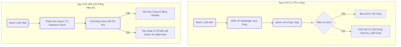
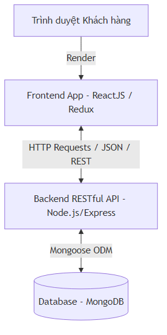
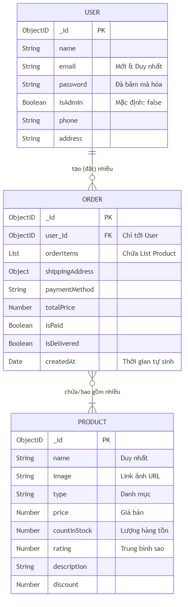
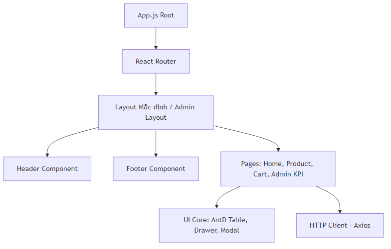
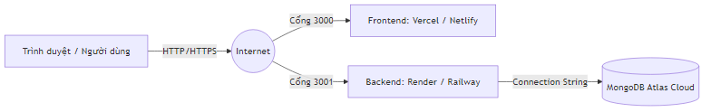
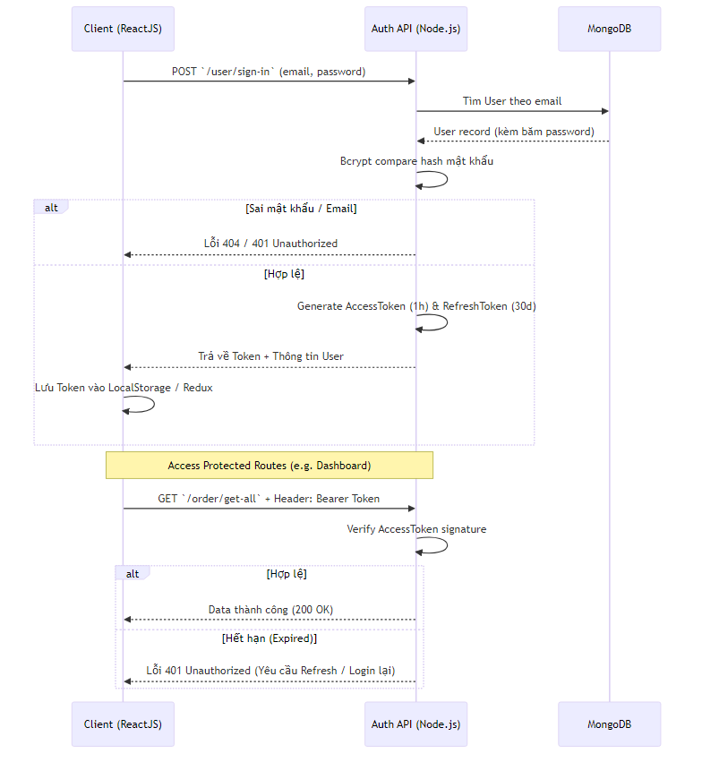
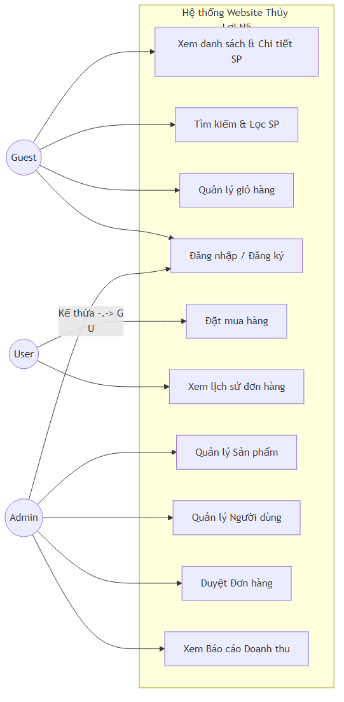
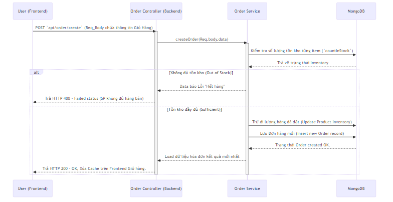

# TÀI LIỆU ĐẶC TẢ YÊU CẦU PHẦN MỀM (URD / SRS)

HỆ THỐNG THƯƠNG MẠI ĐIỆN TỬ

**Nhóm thực hiện:** Thủy Lợi N5
**Môn học:** Công Nghệ Phần Mềm

---

## 1. PHẠM VI TÀI LIỆU

### 1.1 Mục đích, phạm vi tài liệu

- **Mục đích:** Tài liệu này cung cấp mô tả chi tiết các yêu cầu kỹ thuật, nghiệp vụ và chức năng của Hệ thống Thương Mại Điện Tử. Đối tượng đọc tài liệu bao gồm Giảng viên đánh giá, Nhóm phát triển phần mềm (Thủy Lợi N5), và người dùng cuối.
- **Phạm vi tài liệu:** Ghi nhận toàn bộ yêu cầu người dùng, tính năng, phi tính năng và thiết kế sơ lược, cũng như phân tích rủi ro định hướng trong 2 giai đoạn phát triển của website thương mại điện tử.

### 1.2 Diễn giải các thuật ngữ và viết tắt

| Thuật ngữ / Viết tắt | Giải nghĩa chi tiết |
|---|---|
| **MERN Stack** | Bộ 4 công nghệ Javascript: MongoDB, ExpressJS, ReactJS, Node.js. |
| **JWT** | JSON Web Token — Chuỗi ký tự mã hóa dùng để xác thực danh tính người dùng. |
| **MVP** | Minimum Viable Product — Phiên bản sản phẩm tối thiểu, chứa tính năng cốt lõi nhất. |
| **CCU** | Concurrent Users — Số lượng người dùng truy cập đồng thời vào cùng 1 thời điểm. |
| **SLA** | Service Level Agreement — Cam kết chất lượng dịch vụ giữa nhà phát triển và người dùng (VD: tốc độ phản hồi API < 500ms). |
| **Bcrypt** | Thuật toán băm mật khẩu thành các chuỗi kí tự vô nghĩa, đảm bảo bảo mật cao. |

### 1.3 Diễn giải sơ đồ quy trình

Việc số hóa quy trình kinh doanh từ truyền thống sang thương mại điện tử làm thay đổi hành vi tương tác toàn chuỗi, thể hiện rõ ở sơ đồ từ AS-IS (Cũ) sang TO-BE (Mới).

---

## 2. MÔ TẢ CHUNG VỀ YÊU CẦU DỰ ÁN

### 2.1 Địa điểm triển khai

- Hệ thống là một ứng dụng Web (Web Application), triển khai thông qua môi trường Internet.
- **Phía Người dùng (Client):** Truy cập tại bất kỳ vị trí địa lý nào có kết nối Internet thông qua các Trình duyệt (Chrome, Safari, Edge) trên thiết bị Desktop hoặc Mobile.
- **Phía Máy chủ (Server):** Phân tán hệ thống Database trên Cloud (MongoDB Atlas) và Backend API/Frontend Hosted trên các nền tảng dịch vụ đám mây (Render / Vercel).

### 2.2 Chức năng triển khai (Tổng quan)

- **Tự động hóa bán hàng:** Kênh duyệt sản phẩm, tra cứu, đẩy vào giỏ hàng và đặt Checkout không cần tương tác với nhân viên tư vấn.
- **Quản lý báo cáo doanh thu số hóa:** Hệ thống dashboard quản trị đo lường trực quan, sinh xuất file Excel phục vụ kế toán / lưu trữ.

### 2.3 Tổ chức hệ thống trên phần mềm

Hệ thống được tổ chức theo kiến trúc **MERN Stack** vận hành luồng dữ liệu Client-Server:

- **Frontend (ReactJS + Redux):** Giao diện tương tác người dùng dạng Single Page Application (SPA), giúp hệ thống chuyển trang mượt mà.
- **Backend (Node.js + ExpressJS):** Xử lý luồng business logic, các API chuẩn RESTful, non-blocking I/O vận hành hàng ngàn truy vấn đặt hàng đồng thời.
- **Database (MongoDB):** Lưu trữ dạng Document Database rất phù hợp hệ thống có số lượng lớn mặt hàng linh động (schema-less) biến thiên đa dạng.

**Sơ đồ Thực thể Dữ liệu (ERD):**

**Sơ đồ thành phần chức năng và luồng triển khai:**

### 2.4 Mô tả quy tắc chung và phân quyền trên hệ thống

Hệ thống xác định 3 vai trò (Phân quyền Role-based) chính để kiểm soát chặt chẽ quyền truy cập, trong đó người dùng đăng nhập sẽ tương tác thông qua bảo mật JWT Access Token:

1. **Khách hàng vãng lai (Guest):** Chỉ có thể xem danh sách, chi tiết sản phẩm và thêm thử vào giỏ hàng (cục bộ). Chưa được phép thao tác đặt hàng thực.
2. **Khách hàng (User):** Người dùng có tài khoản hệ thống. Được quyền xem thông tin cá nhân, sửa giỏ hàng, đặt mua thanh toán đơn hàng và xem lịch sử đơn.
3. **Quản trị viên (Admin):** Người điều hành website. Được phép truy cập vào Admin Dashboard để CRUD (Tạo, Sửa, Xóa) mọi sản phẩm; Kiểm duyệt quản lý các Account khác; Duyệt sửa đơn hàng và theo dõi Biểu đồ thống kê.

*(Quy trình Xác định danh tính xác thực bằng Tokens mô tả qua Sơ đồ giao tiếp dưới đây)*

### 2.5 Yêu cầu đầu ra của dự án

Sau khi hoàn thành hệ thống, đầu ra cần chuyển giao bao gồm:

- Mã nguồn toàn bộ phần mềm (Source Code Front/Backend).
- Giao diện người dùng Web App tương tác mượt mà, đạt điểm Lighthouse Accessibility > 80/100.
- Trang Dashboard cho Admin hiển thị Chart báo cáo được và trích xuất dữ liệu ra file `.xlsx` thành công.
- Ngăn chặn triệt để tình trạng đặt hàng vượt quá số lượng tồn kho (Stock).

---

## 3. MÔ TẢ CHI TIẾT VỀ CHỨC NĂNG VÀ YÊU CẦU CỦA HỆ THỐNG

### 3.1 Mô tả chung về sản phẩm và khách hàng

Dựa trên nhận diện thực trạng, nhóm đã lập ra bảng Phân tích Định hướng Phát triển (SWOT):

| Điểm mạnh (Strengths) | Điểm yếu (Weaknesses) |
|---|---|
| - Giao diện React hiện đại. - API tự thiết kế chuẩn hóa. - Bảo mật mật khẩu băm thông minh. | - Server test miễn phí bị "ngủ đông". - Tìm kiếm chưa hỗ trợ Fuzzy Search (sai chính tả). |
| **Cơ hội (Opportunities)** | **Thách thức (Threats)** |
| - Lập trình chuẩn REST, dễ dàng nâng cấp. - Tài liệu bài bản chuẩn IEEE. | - Các sàn Shopee/Lazada lớn khó cạnh tranh traffic. - Nguy cơ Bot tấn công DDoS (Đã chặn cơ bản). |

### 3.2 Sơ đồ Use Case và Danh sách chức năng

**Sơ đồ Use Case Diagram:**

**Danh sách các Chức năng sơ cấp cần khai báo (Giai đoạn 1):**

*Khách hàng vãng lai (Guest - Chưa đăng nhập)*

- **UC-U03/U04/U05:** Khám phá cửa hàng (Duyệt toàn bộ kho hàng, Tìm từ khóa, Xem chi tiết sản phẩm).
- **UC-U06/U07:** Quản lý Giỏ hàng cục bộ (Thêm sản phẩm, tăng/giảm số lượng, chỉnh sửa giỏ).
- **Lưu ý:** Nút "Đặt Hàng (Checkout)" sẽ kiểm tra xác thực. Nếu chưa đăng nhập, hệ thống yêu cầu chuyển qua trang Đăng nhập hoặc Đăng ký.

*Khách hàng (User - Đã đăng nhập)*

- **UC-U01/U02:** Đăng ký tài khoản mới / Đăng nhập hệ thống qua Email & Mật khẩu.
- **Kế thừa:** Có quyền sử dụng toàn bộ chức năng khám phá và giỏ hàng của Guest.
- **UC-U08/U09:** Checkout (Đặt hàng) điền/cập nhật thông tin nhận đồ, và Xem danh sách lịch sử các Đơn đã mua theo tài khoản.

*Quản trị viên (Admin)*

- **UC-A01:** Xem, chỉnh sửa, khóa hoặc phân quyền User thành Admin.
- **UC-A02 -> A05:** Cập nhật kho hàng (Thêm hàng mới kèm giá, hình ảnh, tồn kho, Cập nhật thông tin, ngưng bán (xóa)).
- **UC-A06:** Phê duyệt/Thay đổi trạng thái chuyển phát của Đơn Hàng.
- **UC-A07/A08/A09:** Xem các Dashboard biểu đồ Doanh thu (KPIs), Top các Sản phẩm bán tốt nhất, Xuất kho dữ liệu báo cáo ra Excel.

### 3.3 Chi Tiết Về Quy Trình (Đặc tả luồng nghiệp vụ chuẩn)

**Quy trình 1: Đặt mua hàng (Checkout) - UC-U08**

1. User mở Giỏ hàng và tiến hành sang bước Thanh Toán (Checkout). Giỏ của User phải có tồn kho > 0.
2. Web tải sẵn thông tin cá nhân của User (Tên, SĐT, Địa chỉ do họ đã thiết lập trước đó). User có quyền thay đổi địa chỉ nhận hàng tại đây.
3. User Click "Đặt hàng".
4. Tương tác logic: Server thiết lập giảm số lượng tồn (Stock) tương ứng trong CSDL. Một Record ID đơn hàng mới (Trạng thái chờ duyệt) được sinh ra.
5. Giỏ hàng hiện hành của User được Clear (xóa trắng). Hệ thống điều hướng về màn hình đặt hàng thành công.
*(Trường hợp ngoại lệ: Nếu món hàng đó bị người khác mua hết ngay giây trước đó khiến Tồn kho = 0, giao dịch Rollback thao tác và gửi cảnh báo về cho User).*

**Quy trình 2: Xem Báo Cáo Doanh Thu (Dashboard) - UC-A07**

1. User mang quyền Admin xác thực thành công, nhấn vào Sidebar menu "Dashboard".
2. Client React truy xuất Data JSON từ API server (Middleware sẽ verify JWT có flag `isAdmin = true`).
3. Dưới Database MongoDB, các lệnh Aggregation chạy gom nhóm tính tổng doanh thu những đơn hàng có `isPaid = true` khớp theo Thời gian tùy chỉnh (Ngày, Tuần, Tháng).
4. Dữ liệu được đưa qua mảng cho Recharts vẽ trực quan (Biểu đồ Đường báo cáo).

### 3.4 Yêu cầu Kỹ thuật / Phi chức năng

- Hệ thống hỗ trợ bộ lọc và API hiệu năng cao (Thời gian phản hồi truy vấn **< 500ms**, chịu tải **500 CCU**) nhờ kỹ thuật Fetch và Cache từ component React Query.
- Bảo mật: Các thông tin nhạy cảm của người dùng (Credit token, Mật khẩu hệ thống) được mã hoá với Bcrypt và khóa bí mật lưu cục bộ dưới biến môi trường `.env`.
- Mã nguồn Back-End cần thiết kế theo luồng Controller-Service-Model chặt chẽ (Loose coupling/Mongoose ORM).
- Áp dụng các Sprint của quy trình Agile Scrum cho phép đội ngũ bảo trì và có thể phát triển thêm Phase 2 dễ dàng (Đánh giá hạng sao Review, Mã Voucher Sale Giảm Giá, Gửi Email báo tự động).

### 3.5 Dự tính mức độ tải và dung lượng hệ thống (System Sizing)

Dự toán tài nguyên (Sizing) nhằm đảm bảo hệ thống duy trì tính sẵn sàng cao không bị gián đoạn, tối ưu chi phí hạ tầng trong giai đoạn đầu và có thể tự động co giãn (Auto-scaling) ở giai đoạn sau.

**1. Sizing theo Lượng truy cập (Traffic & Computing CPU/RAM):**

- **Traffic dự kiến:** Trung bình 5.000 - 10.000 lượt truy cập/ngày (DAU). Khung giờ cao điểm (Peak Time) chịu tải được khoảng 500 CCU đồng thời.
- **Tùy chọn Server Backend:** Node.js chạy dạng non-blocking. Cấu hình đề xuất tối thiểu 1 vCPU, 2GB RAM cho máy chủ Ứng dụng.
- **Băng thông mạng (Bandwidth):** Lớp giao diện (Frontend React) được đóng gói và đặt tại Edge CDN của nền tảng Vercel giúp giảm hao tổn bằng thông tĩnh, phân tải máy chủ gốc (Origin Server).

**2. Sizing theo Dung lượng lưu trữ (Database & Media Storage):**

- **Dữ liệu dạng văn bản (MongoDB JSON Storage):** Lưu hồ sơ User, log Giao dịch đơn hàng, Catalog Sản phẩm. MongoDB Atlas gói 512MB - 1GB là đủ để chứa đến hàng chục nghìn lượt mua sắm mới mỗi tháng, vì JSON text cực kỳ tiết kiệm bộ nhớ.
- **Dữ liệu tập tin lớn (Media lưu trữ hình ảnh):**
  - Thay vì lưu thẳng ảnh sản phẩm vào Database khiến máy chủ DB nặng, các file ảnh (Banners, Sản phẩm) tải lên qua hệ thống lưu trữ đối tượng bên thứ ba, điển hình là Cloudinary chuyên dụng.
  - Sizing ước chừng với kho 5.000 sản phẩm (mỗi cái 2-3 ảnh), sử dụng chuẩn nén `.WebP` size ~150kb, chi phí lưu trữ ảnh dao động ở mức 2GB - 5GB giai đoạn đầu tiên xây dựng.

---
