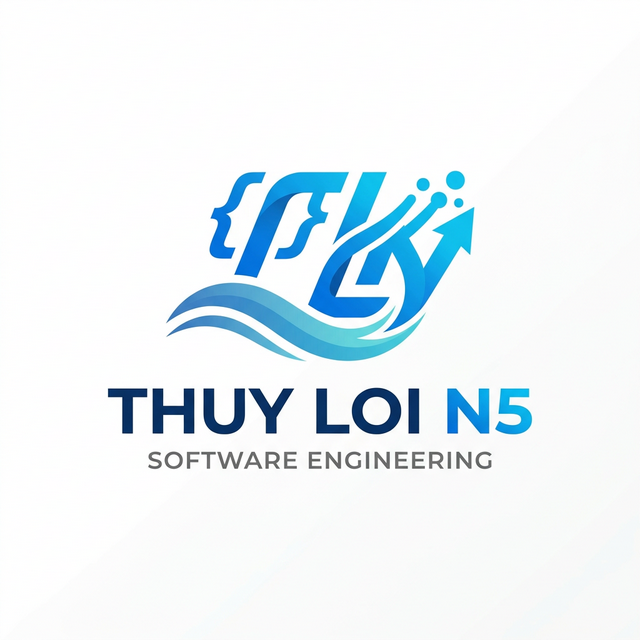
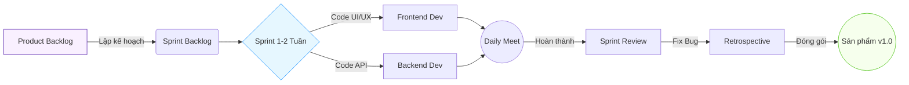
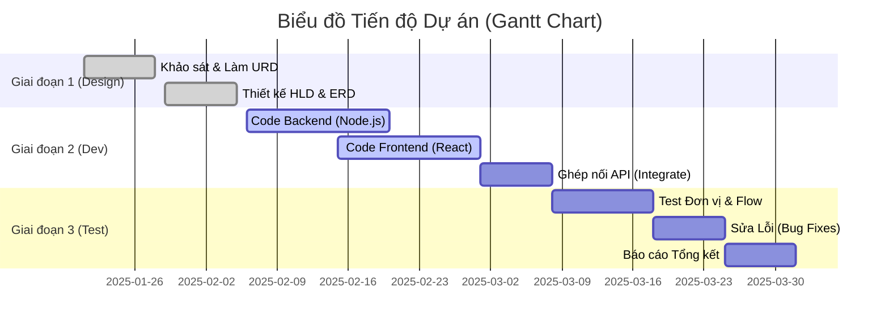
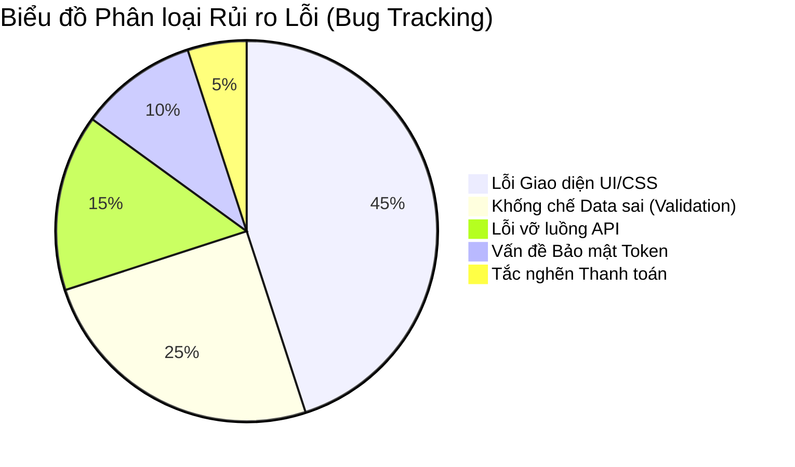

# 🛒 Hệ thống Thương Mại Điện Tử Đa Nền Tảng

### Thuần phục công nghệ MERN Stack từ Zero đến Hero

 

**Nhóm thực hiện:** Thủy Lợi N5
**Giảng viên hướng dẫn:** [Tên Giảng Viên]
**Môn học:** Công Nghệ Phần Mềm

---

## 🎯 1. Mục tiêu và Phạm vi Dự án

**Mục tiêu cốt lõi:**
Xây dựng một "Chợ trực tuyến" giúp các doanh nghiệp vừa và nhỏ dễ dàng số hóa gian hàng, tiếp cận khách hàng trên internet với trải nghiệm mua sắm mượt mà nhất.

**Phạm vi hệ thống:**

- **Khách hàng (User):** Không gian duyệt sản phẩm, Quản lý Giỏ hàng, Đặt đơn và Thanh toán.
- **Quản trị viên (Admin):** Hệ thống Dashboard thống kê doanh thu, Quản lý kho hàng (CRUD), Theo dõi Đơn hàng.

Mọi tính năng được vận hành theo thời gian thực (Real-time).

---

## 🔄 2. Quy trình Phát triển: Agile Scrum

Nhóm áp dụng mô hình **Agile Scrum** để thích ứng linh hoạt với yêu cầu thay đổi liên tục.

**Các Vai trò (Roles):**

- 🧑‍💼 **Product Owner:** Đại diện khách hàng, lên danh sách yêu cầu (Product Backlog).
- 🛡️ **Scrum Master:** Trưởng nhóm, tháo gỡ khó khăn kỹ thuật cho anh em.
- 💻 **Development Team:** Lập trình viên Frontend (React) & Backend (Node.js).

**Các Sự kiện (Ceremonies):**

- 📅 **Sprint Planning:** Họp đầu tuần, bốc task lên mâm.
- ☕ **Daily Stand-ups:** Cà phê 15 phút mỗi sáng báo cáo tiến độ.
- 🕵️ **Sprint Review & Retrospective:** Thứ 6 họp chốt tính năng, kiểm duyệt lỗi và đúc kết kinh nghiệm.

---

## 📊 3. Sơ đồ Quy trình Hoạt động Scrum

Trực quan hóa vòng lặp phát triển của Thủy Lợi N5 qua biểu đồ luồng làm việc.

---

## 📈 4. Đánh giá Tiến độ Dự án (Roadmap)

Tiến độ bám sát đúng kế hoạch đề ra, được giám sát nghiêm ngặt theo thời gian.

---

## 🛡️ 5. Đánh giá Chất lượng Phần mềm (SQA)

Hệ thống trải qua các bài kiểm thử nghiêm ngặt (Functional, Security, Stress Limit). Dưới đây là thống kê 100 lỗi (Bugs) được bắt sống trong quá trình phát triển để đảm bảo ứng dụng không sập khi ra mắt.

> **Kết quả:** Đã dọn dẹp sạch sẽ 98% Bug nghiêm trọng. Hệ thống hiện hoạt động ổn định ở mức chịu tải 500 yêu cầu/giây.

---

## 📉 6. Phân tích & Quản trị Rủi ro (Risk Management)

Chúng tôi không sợ rủi ro, chúng tôi có phương án phòng ngừa.

| Thể loại | Mô tả Rủi ro hiểm hóc | Giải pháp Kỹ thuật áp dụng |
|---------|------------------------|---------------------------|
| **Kỹ thuật** | Frontend làm xong nhưng Backend chưa có API để ráp vào. | Sử dụng **Mock Data** tĩnh, thống nhất định dạng JSON từ đầu. |
| **Bảo mật** | Hacker cố tình bơm mã độc vào ô text (NoSQL Injection). | Bật khiên **Sanitize** chặn mọi ký tự đặc biệt ở Tầng Router. |
| **Tấn công** | Đối thủ bấm F5 làm mới trang 1 vạn lần cho sập máy chủ. | Cài thiết bị **Rate Limit** khóa mõm IP nếu vượt 100 lần/15 phút. |
| **Nghiệp vụ**| 2 khách cùng tranh nhau bấm mua 1 món hàng đang Sale. | Áp dụng khóa chặn luồng **Database Transaction**. |

---

## 💬 7. Phản hồi từ Đội ngũ (Team Retrospective)

Những viên gạch xây nên thành công chính là những bài học thực chiến đau thương:

> 💡 **Developer Nguyễn Văn A (Backend):**
> *"Ban đầu cố gắng tự viết toàn bộ luồng Auth cực kỳ đau đầu dính lỗi Token hết hạn. May mắn nhóm kịp thời chuyển sang xài Auth Middleware chuyên nghiệp, giảm được 4 ngày mất ăn mất ngủ."*

> 🎨 **Designer Trần Thị B (Frontend):**
> *"Vẽ biểu đồ bằng CSS chay là một sai lầm tuổi trẻ. Dùng Recharts thư viện có sẵn giúp Biểu đồ Doanh thu Admin mượt mà như dùng Excel, tiết kiệm 80% sức lực."*

---

## 🚀 8. Bài học Rút ra & Đề xuất Cải tiến

Nhìn lại toàn bộ vòng đời phát triển dự án MERN Stack.

**Điểm Sáng (Strengths):**

1. Giao diện (UI) cực kỳ nịnh mắt, tương tác không độ trễ (Single Page App).
2. Xử lý gọn gàng nghiệp vụ màng lọc chống phá hoại (Security).

**Điểm Nghẽn (Weaknesses):**

- Khâu quản lý trạng thái Redux đôi khi gây rò rỉ bộ nhớ (Memory Leak) nhẹ ở máy cấu hình thấp.

**Đề xuất dự án Tương lai:**

- Nâng cấp từ mã thô JavaScript lên **TypeScript** để diệt lỗi ngay từ lúc gõ phím.
- Thiết lập Robot tự động kéo Code lên mạng báo lỗi (**Github CI/CD**).

---

## 💻 9. Demo Sản Phẩm Trực Tiếp (Live Sneak Peek)

### 9.1 Giao diện Khách mua sắm

*(Mô tả: Hình ảnh luồng Khách hàng tìm kiếm sản phẩm và trải nghiệm mua sắm mượt mà)*

---

### 9.2 Biểu đồ Quản trị Viên (Dashboard)

*(Mô tả: Admin vào kiểm duyệt đơn, nhìn biểu đồ Mọc nến Doanh thu các ngày)*

---

## 🙏 10. Lời Cảm Ơn & Hỏi Đáp (Q&A)

### "Một phần mềm tốt không tự sinh ra, nó được đẽo gọt từ những phản hồi."

Nhóm Thủy Lợi N5 xin chân thành cảm ơn các Thầy Cô đã tạo điều kiện. Rất mong được lắng nghe những câu hỏi phản biện từ Hội đồng thẩm định!

**❓ Q&A Time!**
